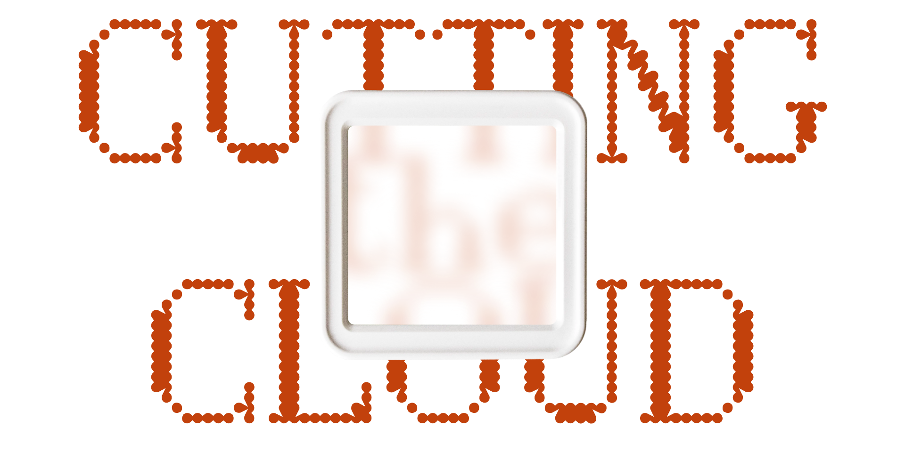

# Cutting the Cloud

As our homes become smarter, more technological infrastructure is becoming an integral part of our homes. It is changing the way we behave and interact with one of our most private and sensitive spaces.

_Cutting the Cloud_ is an artistic research and hacking project that explores multi-layered infrastructure surrounding smart home technology. Using a 7€ battery-powered temperature sensor from Aliexpress as a case study, the project explores the hidden economics, labor conditions, and data dependencies that enable such devices to be sold at impossibly low prices. The research concludes with an attempt to free the device from its proprietary cloud ecosystem, representing both a technical challenge and an artistic statement about digital independence.

The insights gained by looking at the temperature sensor from different perspectives have been collected in an interactive website. Through freeing the temperature sensor from the cloud it became part of the website controlling how much of the research will be visible in the end.
